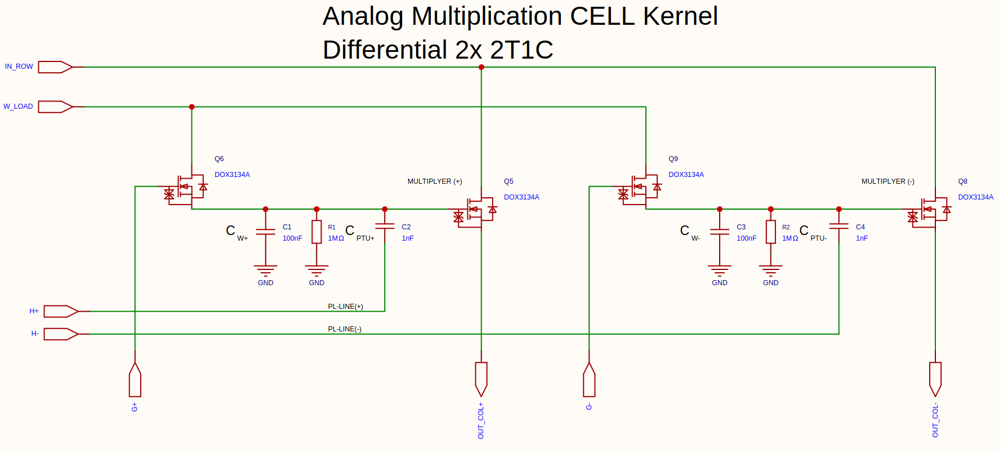
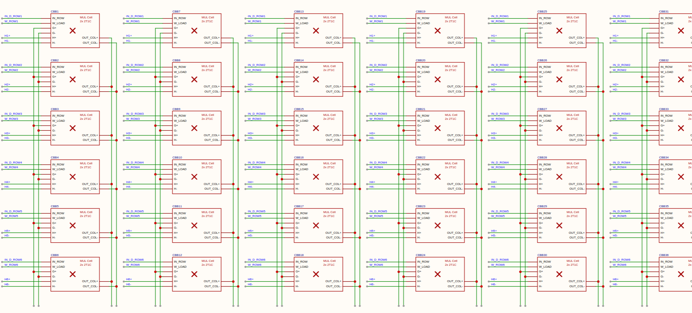
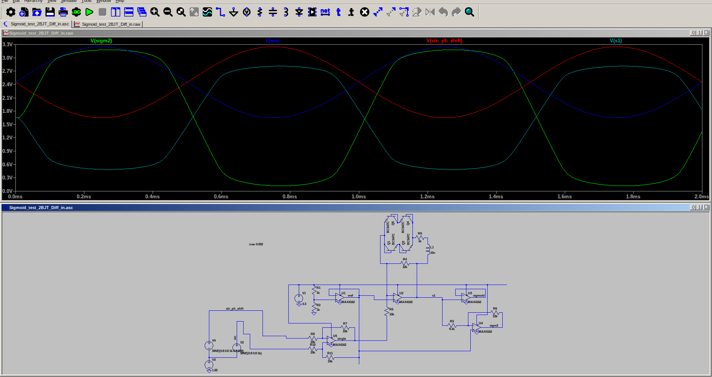

# Analog Matrix Multiplication with Proprioception
### Patent pending: document inverterad MAML_12_Eng.pdf translated
`inverterad MAML_12_Eng.pdf`

#### PATENT APP NO: SE 2630397-4
#### STATUS: PATENT PENDING
#### INVENTOR: OLLE WELIN
#### PRIORITY DATE: 2026-06-03
## Analog 2T1C Matrix with Inverted Meta-Learning (MAML)

### Project Vision: Redefining Efficient Inference

The primary goal of this project is to drastically reduce power consumption for Neural Network inference. By moving away from energy-intensive digital data movement and leveraging In-Memory Computing (IMC), we aim to overcome the traditional "memory wall."

Our approach combines analog matrix hardware with a novel Inverted Meta-Learning (MAML) algorithm. Instead of adapting to external input data, our system uses intrinsic meta-learning to dynamically calibrate and compensate for hardware non-idealities—such as thermal drift, component aging, and voltage leakage—in real-time during ongoing operations.

### The Adventure of Discovery
Working with analog computing is an act of balancing physics and precision. Very funny and exciting project!

### Status and Disclaimer
2026-06-10: Nothing is yet tested or simulated. This is currently only a plan to build a test board with a 3x 6x6 matrix PCB at 500 kHz throughput, 8-bit R-2R DACs, 10-bit SAR ADCs, a Trion FPGA, and N-channel transistors.

#### Disclaimer: 
The 
`pod_inverted_maml_audiobook_96k.m4a`
states that this has already been tested and run; this is not true. NotebookLM is simply trying to summarize the patent document without knowing the current status.

### Mutiplication cell

### 6x6 matrix EasyEDA

### LTspice simulation sigmoid OP-amp

