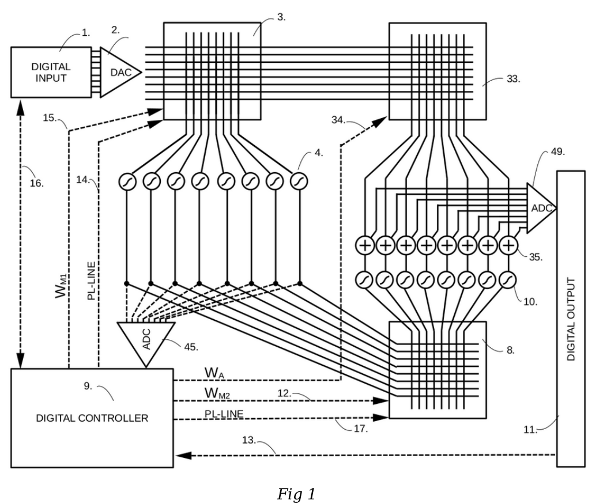

# Analog Matrix Multiplication with Proprioception
## Analog 2T1C Matrix with Inverted Meta-Learning (MAML)

### Project Vision: Redefining Efficient Inference

The primary goal of this project is to drastically reduce power consumption for Neural Network inference. By moving away from energy-intensive digital data movement and leveraging In-Memory Computing (IMC), we aim to overcome the traditional "memory wall."

Our approach combines analog matrix hardware with a novel Inverted Meta-Learning (MAML) algorithm. Instead of adapting to external input data, our system uses intrinsic meta-learning to dynamically calibrate and compensate for hardware non-idealities—such as thermal drift, component aging, and voltage leakage—in real-time during ongoing operations.

### The Adventure of Discovery
Working with analog computing is an act of balancing physics and precision. Very funny and exciting project!

### Status and Disclamer
2026-06-10 Nothing is yet tested or simulated only a plan to do a test board of  3x 6x6 matrix PCB board at 500Khz throughput, 8bit R-R2 DAC's and 10bit ADC SAR and FPGA Trion and N-channel transistors
Disclaimer the POD tell this tli ther is already tested and runned thet is not true NotebookLM just try to summirize the patetn document without knowing the status.

### PATENT APP NO: SE 2630397-4
### STATUS: PATENT PENDING
### INVENTOR: OLLE WELIN
### PRIORITY DATE: 2026-06-03
